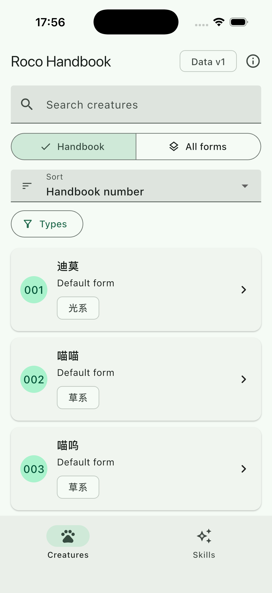
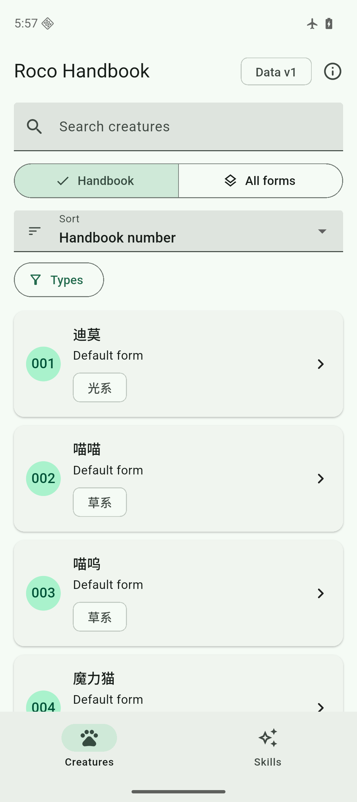

# Phase 3 Flutter App evidence

- Date: 2026-09-09
- Flutter: 3.47.2 stable
- Dart: 3.13.2
- Catalog: schema 1, data version 1
- Runtime data source: bundled local SQLite only

## Automated checks

`flutter analyze` completed with no issue. `flutter test` passed 19 tests covering:

- exact concrete-form search and stable display numbers;
- numeric normalization and literal wildcard handling;
- complete paging without overlap;
- explicit type filtering and whitelisted stat sorting;
- full three-form detail switching;
- feature and learnable relationship separation;
- evidence-backed evolution edges and explicit NotFound errors;
- first installation, manifest and core coverage checks, hash and schema verification, read-only write rejection, active-pointer creation, same-version reuse, and staging cleanup;
- stale search suppression, dark theme, 2.0 text scale, and the local preparation message.

The root Python suite also compares the three bundled App assets byte-for-byte with the validated release and scans production Dart for the English-only project rule.

## iOS simulator

An iPhone 17 Pro simulator on iOS 26.5 built and launched the debug App. First launch created `catalogs/catalog-v1-s1.db` and `catalog-state/active_catalog.json` in private application support storage. The installed database was 3,424,256 bytes with SHA-256 `2c27ddc3cd36f543ea6319ea9878b4a3c8b8a9a89afad6bd6eaacfd9592ed8f2`; integrity returned `ok`, data version was 1, snapshot ID was `snapshot-19235f9b9b34dc4e`, and the creature count was 596.

A terminate and relaunch retained the database inode, modification time, and byte size, proving same-version startup did not recopy the file.

The final screenshot SHA-256 is `cebdfb6fe4617327ea661a670af46b47de688a96548c12b4fdeea09e3133d1ea`.

The first iOS build attempt failed because the macOS file-provider workspace added Finder extended attributes to the copied Flutter framework before temporary signing. Moving only the ignored build output to `/tmp` removed that environmental attribute boundary; the project source and global Flutter SDK were not changed. The subsequent simulator build and launch passed.

## Android emulator in airplane mode

The Android API 36 arm64 emulator reported airplane mode `1` and Wi-Fi `0` before installation. The debug APK built, installed, and launched while those settings remained active. The App created `files/catalogs/catalog-v1-s1.db` and its active pointer. The installed database SHA-256 matched the release exactly.

A forced stop and launcher restart while still in airplane mode retained the database inode, modification time, and byte size. This proves first-launch local installation and same-version reuse on the Android emulator without a runtime data connection.

The final screenshot SHA-256 is `4bbf0265982e223f77592a5bc99d71de8219be02fe6555bb886fcd913f3797a5`.

## Environment notes and unrun layers

The Android debug build emitted upstream toolchain warnings about the JDK native-access transition and SDK XML version compatibility. They did not fail compilation or installation. `flutter doctor` reported Android license status as unknown even though the required Android 35 platform and CMake component were accepted and installed by the build.

No physical iOS or Android device was modified. iOS flight-mode simulation, physical-device touch and performance checks, code signing, release-mode archives, store upload, and App publication were not run. No `user.db` exists in the App implementation.
