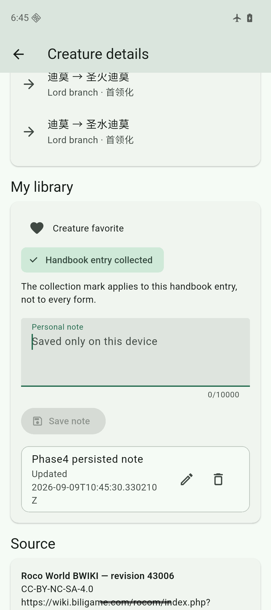
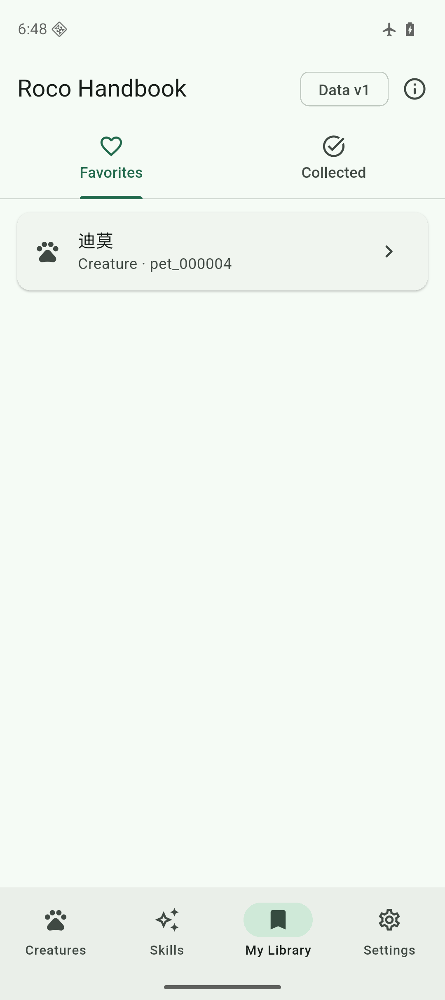

# Phase 4 personal-data evidence

- Date: 2026-09-09
- Flutter: 3.47.2 stable
- Dart: 3.13.2
- User schema: 1
- Catalog data version: 1

## Automated checks

`flutter analyze` completed with no issue. `flutter test` passed 32 tests. Phase 4 coverage includes:

- normative User V1 creation and same-version reuse;
- unknown-version rejection without deleting or rebuilding the existing file;
- invocation-owned staging cleanup after failed first creation;
- idempotent explicit favorite and handbook collection state;
- note creation, editing, deletion, object-identity protection, and repository restart persistence;
- personal records for missing Catalog objects;
- committed stream updates while production operations run in background isolates;
- list and detail favorite actions, handbook collection copy, successful note save, retained editor draft after a forced write failure, and missing-object UI;
- four-destination navigation and the existing dark-theme and 2.0 text-scale checks.

The root Python suite passed 58 tests, including byte parity between `schemas/user_v1.sql` and the bundled App schema asset.

## Android airplane-mode flow

The Android API 36 arm64 emulator remained in airplane mode with Wi-Fi disabled. The latest debug APK created `files/user/user.db` with schema version 1, a valid singleton metadata row, and `integrity_check = ok`.

Through the visible App UI, the test flow saved one concrete creature favorite, one handbook-level collection mark, and one creature note. Direct readback showed the stable IDs `pet_000004` and `handbook_000001` with their name snapshots. A forced stop and launcher restart retained one row in each table. The personal database inode, modification time, and size remained `558252:1788950730:49152` across that restart, and integrity still returned `ok`.

Screenshot SHA-256: `46d19f1e66c320497038c0c72fad6a04da81d201621b20d70f1e559bd637231d`.

Screenshot SHA-256: `febe93e41fc1c7f4ae47960262a17c8053bfc90f07381e44d680053add33c8be`.

## iOS simulator

The repaired debug build was installed on the iPhone 17 Pro simulator running iOS 26.5. The App created `Library/Application Support/user/user.db` at 49,152 bytes with schema version 1, valid metadata, `integrity_check = ok`, and empty personal tables before user actions.

No personal records were entered through the iOS simulator in this phase, so cross-restart personal-content evidence is Android-only. The shared repository, schema, and Widget tests ran on the macOS Flutter test host, not on a physical iOS device.

## Runtime defect found and closed

The first Android interaction exposed an isolate-transfer failure: a database closure captured the repository instance after active UI streams had attached, which also captured unsendable stream and Widget state. The repository now copies only the database path into the isolate closure. A production-mode test keeps a favorite watcher active during an isolated write and read, preventing recurrence.

## Unrun layers

- Physical iOS or Android installation
- iOS UI entry and restart of non-empty personal data
- Device uninstall-risk validation
- User schema V2 migration, consistent backup, export, or import
- Catalog update, rollback, bundled recovery, or retention cleanup
- Release signing, archives, upload, or publication
