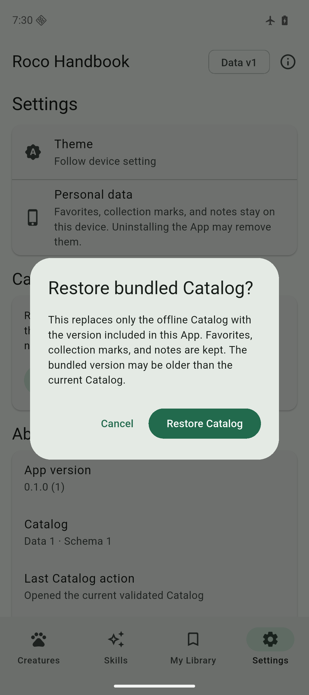
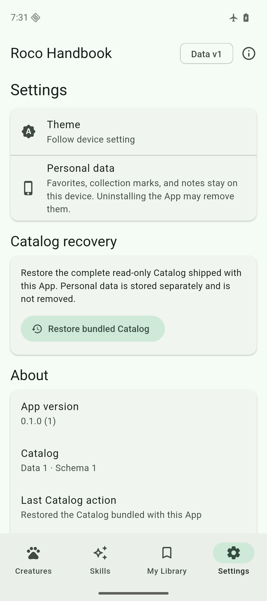

# Phase 5 Catalog replacement and recovery evidence

- Date: 2026-09-09
- Flutter: 3.47.2 stable
- Dart: 3.13.2
- Bundled Catalog data version: 1
- Catalog schema: 1
- User schema: 1

## Automated checks

`flutter analyze` completed with no issue. `flutter test` passed 43 tests: 14 installer lifecycle tests, 10 Catalog repository tests, nine User V1 tests, and 10 Widget flows. The root Python suite passed 58 tests.

The installer tests use copied real Catalog V1 bytes plus an owned data-version-2 fixture. They cover:

- first installation, complete validation, read-only opening, and same-version reuse;
- migration of the Phase 3 four-field pointer without recopying its database;
- whole-database activation with added, modified, and retired fixture records;
- retention of one distinct previous version and refusal to auto-downgrade a newer compatible active version;
- a byte-for-byte User V1 logical snapshot before and after successful replacement;
- an abandoned staging file representing interruption after copy, followed by safe retry cleanup;
- invalid SHA-256, schema, and dataset contracts without active-pointer replacement;
- rollback after an injected post-pointer open failure;
- an injected storage-write failure with the active Catalog and User V1 unchanged;
- damaged active-pointer recovery through only the recorded previous artifact;
- pointer path-injection rejection and direct-child allowlisted cleanup;
- explicit bundled recovery to an older data version with the User V1 logical snapshot unchanged; and
- a confirmation-gated recovery action and result copy in the Settings UI.

The data-version-2 database exists only inside temporary test directories. It is not a release artifact or a claim that Catalog data version 2 has been built for distribution.

## Android emulator

The Android API 36 arm64 emulator remained in airplane mode with Wi-Fi disabled. Before installing the latest debug APK over the existing App, the active Catalog used the Phase 3 four-field pointer and `catalog-v1-s1.db`. User V1 contained one favorite, one collected handbook, and one note; its SHA-256 was `47e4ef7fa310c8c2fb882e2e462ead3f1f3b1c899bf7dae10853d03c0e2b3062`.

An in-place debug APK install and cold launch migrated the pointer to the complete descriptor without copying or modifying the legacy Catalog file. The personal database remained byte-for-byte identical and retained all three records.

The visible Settings flow showed the local recovery explanation and required a separate confirmation stating that personal data is kept and the bundled version may be older. Confirming recovery produced the canonical hash-qualified active file and reported **Restored the Catalog bundled with this App**. The original personal database again remained byte-for-byte identical with one favorite, one collected handbook, and one note. Recovery temporarily retained the equivalent legacy file as the rollback record; a final normal launch recognized that both descriptors named the same artifact, removed the duplicate previous record and file, and left one active Catalog.

Screenshot SHA-256: `67035b2d08a34d598231aec3f5daa14c342b35cc85feccb6a6707c2fd2a055b9`.

Screenshot SHA-256: `7ea73feafafb33104db70e55af1faa67027dd5baf3fcf7bce3c2e08e21ea44ae`.

Both screenshots were visually inspected. The confirmation, warning copy, recovery button, result state, version information, and bottom navigation were readable without clipping.

## iOS simulator

The iPhone 17 Pro simulator running iOS 26.5 received the latest debug App through an in-place simulator install. After readiness, its Phase 3 pointer was migrated to the complete descriptor while continuing to reference the existing `catalog-v1-s1.db`.

The existing empty User V1 database remained byte-for-byte identical with SHA-256 `b0bbd5f414af212c7106dc2ee37b41d61f27a04fa1f89a7f36e5b9e137663a45`, and `PRAGMA integrity_check` returned `ok`.

## Build checks

The Android debug APK and iOS simulator debug App both built successfully from the Phase 5 source. The main Android manifest still has no Internet permission.

## Unrun layers

- Physical iOS or Android update, recovery, interruption, and low-storage testing
- A real operating-system process kill during copy or pointer replacement
- Real device storage exhaustion; the automated suite uses deterministic injected failure
- Device installation of a distinct release Catalog data version 2
- Manual recovery interaction on iOS
- Release-mode signing, archive, upload, publication, or store-managed upgrade

These omissions mean the evidence proves the local state machine, desktop-host fault model, Android emulator recovery UI, and simulator pointer compatibility. It does not prove physical flash durability, platform low-storage behavior, or store update semantics.
