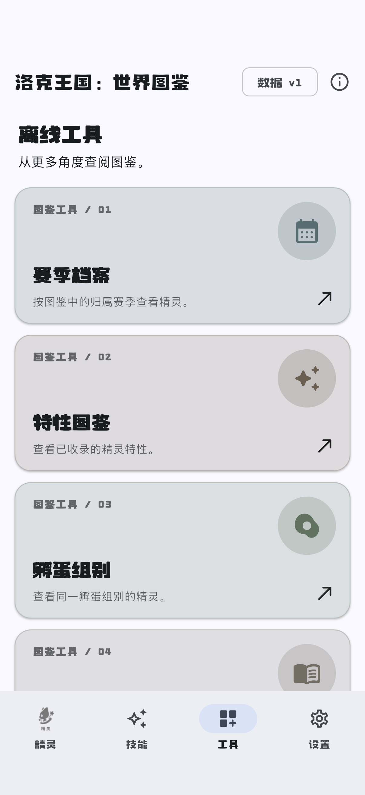

# Phase 8 typography evidence

- Date: 2026-09-11
- Font asset version: 1

## Source observation

The current Wiki site stylesheet defines `MIANFEIZITI` from `MIANFEIZITI.ttf` and `MIANFEIZITI-NUM` from `MIANFEIZITI-NUM.ttf`. It applies the primary family to game-facing menu, search, and `font-roco` selectors while retaining system or regular Chinese sans-serif text for other content. ADR-0019 preserves that role separation instead of applying one decorative font globally.

## Frozen assets

| Runtime family | Role | Local bytes | SHA-256 |
| --- | --- | ---: | --- |
| `RocoDisplay` | Headings, titles, and labels | 4,563,796 | `88c062409b4d683dd0540dba50b06d7b425274e13430ec75112e0e4d1191a3e9` |
| `RocoNumbers` | Selected numeric values | 4,312 | `5b0a03103847c60331290788168d564b384b60a9a134c8ec2b9f00c3cc410b0d` |

The immutable font manifest records two files and 4,568,108 total local bytes. Its SHA-256 is `deeca1ff3faadc618a803c05892f443fb4c291b754984178f2085ef8bd11c20e`.

## App boundary

Both font files are bundled through `app/pubspec.yaml`. The App reads no stylesheet and performs no runtime Wiki or font-CDN request. Body text keeps the platform-default face, while the display family covers Material display, headline, title, and label roles. Explicit numeric styling is limited to handbook identifiers, creature detail metrics, skill values, and activity dates.

## Verification

The focused offline importer suite passed four tests covering immutable import and reuse, source-host rejection, changed-payload rejection, existing-file tamper rejection, and the tracked asset contract. The focused Flutter typography suite passed two tests covering theme-role separation and packaged font byte counts. The existing 23-test catalog flow passed, including dark theme, enlarged text, Chinese UI, adaptive form subtitles, creature and skill cards, Tools routes, and navigation.

Complete Python, Flutter, static-analysis, format, build, and simulator results are recorded in the Phase 8 implementation report.

The iPhone 17 simulator completed the Phase 8 integration route with the new typography. The 1206 × 2622 Tools capture shows display-role rendering in the App title, page title, card overlines, card titles, and bottom navigation while card descriptions retain the body role. Its SHA-256 is `6d96c011709692e0de0bb12b455c26649942b6753ab2aedbf089b13a0ad1c826`.

The existing store screenshot set predates ADR-0019 and remains historical visual evidence. It must be regenerated before store submission so the listing matches the current typography.
